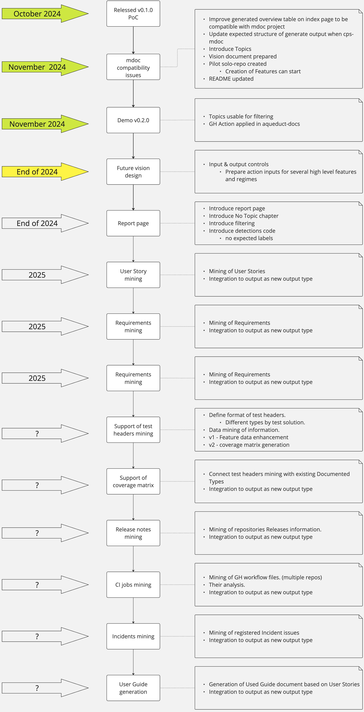

# Living Documentation Generator

- [Motivation](#motivation)
- [Usage](#usage)
    - [Prerequisites](#prerequisites)
    - [Adding the Action to Your Workflow](#adding-the-action-to-your-workflow)
- [Action Configuration](#action-configuration)
    - [Environment Variables](#environment-variables)
    - [Inputs](#inputs)
    - [Features de/activation](#features-deactivation)
- [Action Outputs](#action-outputs)
- [Expected Output](#expected-output)
    - [Index page example](#index-page-example)
    - [Issue page example](#issue-page-example)
- [Documentation Ticket Introduction](#documentation-ticket-introduction)
  - [Labels](#labels)
  - [Hosting Documentation Tickets in a Solo Repository](#hosting-documentation-tickets-in-a-solo-repository)
- [Project Setup](#project-setup)
- [Run Scripts Locally](#run-scripts-locally)
- [Run Pylint Check Locally](#run-pylint-check-locally)
- [Run Black Tool Locally](#run-black-tool-locally)
- [Run Unit Test](#run-unit-test)
- [Code Coverage](#code-coverage)
- [Deployment](#deployment)
- [Features](#features)
    - [Data Mining from GitHub Repositories](#data-mining-from-github-repositories)
    - [Data Mining from GitHub Projects](#data-mining-from-github-projects)
    - [Living Documentation Page Generation](#living-documentation-page-generation)
    - [Structured Output](#structured-output)
    - [Output Grouped by Topics](#output-grouped-by-topics)
- [Contribution Guidelines](#contribution-guidelines)
- [License Information](#license-information)
- [Contact or Support Information](#contact-or-support-information)



A tool designed to data-mine GitHub repositories for [documentation tickets](#documentation-ticket-introduction) containing project documentation (e.g. tagged with feature-related labels). This tool automatically generates comprehensive living documentation in Markdown format, providing detailed feature overview pages and in-depth feature descriptions.

## Motivation

Addresses the need for continuously updated documentation accessible to all team members and stakeholders. Achieves this by extracting information directly from GitHub issues and integrating this functionality to deliver real-time, markdown-formatted output. Ensures everyone has the most current project details, fostering better communication and efficiency throughout development.

## Usage

### Prerequisites

Before we begin, ensure you have a GitHub Token with permission to fetch repository data such as Issues and Pull Requests.

### Adding the Action to Your Workflow

See the default action step definition:

```yaml
- name: Generate Living Documentation
  id: generate_living_doc
  uses: AbsaOSS/living-doc-generator@v0.1.0
  env:
    GITHUB_TOKEN: ${{ secrets.LIV_DOC_ACCESS_TOKEN }}  
  with:
    repositories: '[
      {
        "organization-name": "fin-services",
        "repository-name": "investment-app",
        "query-labels": ["feature", "enhancement"],
        "projects-title-filter": []
      },
      {
        "organization-name": "health-analytics",
        "repository-name": "patient-data-analysis",
        "query-labels": ["functionality"],
        "projects-title-filter": ["Health Data Analysis Project"]
      },
      {
        "organization-name": "open-source-initiative",
        "repository-name": "community-driven-project",
        "query-labels": ["improvement"],
        "projects-title-filter": ["Community Outreach Initiatives", "CDD Project"]
      }
    ]'
```

See the full example of action step definition (in example are used non-default values):

```yaml
- name: Generate Living Documentation
  id: generate_living_doc
  uses: AbsaOSS/living-doc-generator@v0.1.0
  env:
    GITHUB_TOKEN: ${{ secrets.LIV_DOC_ACCESS_TOKEN }}  
  with:
    # input repositories + feature to filter projects
    repositories: '[
      {
        "organization-name": "fin-services",
        "repository-name": "investment-app",
        "query-labels": ["feature", "enhancement"],
        "projects-title-filter": []
      },
      {
        "organization-name": "health-analytics",
        "repository-name": "patient-data-analysis",
        "query-labels": ["functionality"],
        "projects-title-filter": ["Health Data Analysis Project"]
      },
      {
        "organization-name": "open-source-initiative",
        "repository-name": "community-driven-project",
        "query-labels": ["improvement"],
        "projects-title-filter": ["Community Outreach Initiatives", "CDD Project"] 
      }
    ]'
    
    # output directory path for generated documentation
    output-path: "/output/directory/path"

    # project state mining feature de/activation
    project-state-mining: true

    # structured output feature de/activation
    structured-output: true
    
    # group output by topics feature de/activation
    group-output-by-topics: true

    # project verbose (debug) logging feature de/activation
    verbose-logging: true
```

## Action Configuration

Configure the action by customizing the following parameters based on your needs:

### Environment Variables

- **LIV_DOC_ACCESS_TOKEN** (required):
  - **Description**: GitHub access token for authentication, that has a permission to fetch from requested repositories.
  - **Usage**: Store it in the GitHub repository secrets and reference it in the workflow file using  `${{ secrets.LIV_DOC_ACCESS_TOKEN }}`.
  - **Example**:
    ```yaml
    env:
      GITHUB_TOKEN: ${{ secrets.LIV_DOC_ACCESS_TOKEN }}
    ```

#### How to Create a Token with Required Scope

1. Go to your GitHub account settings.
2. Click on the `Developer settings` tab in the left sidebar.
3. In the left sidebar, click on `Personal access tokens` and choose `Tokens (classic)`.
4. Click on the `Generate new token` button and choose `Generate new token (classic)`.
5. Optional - Add a note, what is token for and choose token expiration.
6. Select ONLY bold scope options below:
   - **workflow**
   - write:packages
     - **read:packages**
   - admin:org
     - **read:org**
     - **manage_runners:org**
   - admin:public_key
     - **read:public_key**
   - admin:repo_hook
     - **read:repo_hook**
   - admin:enterprise
     - **manage_runners:enterprise**
     - **read:enterprise**
   - audit_log
     - **read:audit_log**
   - project
     - **read:project**
7. Copy the token value somewhere, because you won't be able to see it again.
8. Authorize new token to organization you want to fetch from.
    
#### How to Store Token as a Secret

1. Go to the GitHub repository, from which you want to run the GitHub Action.
2. Click on the `Settings` tab in the top bar.
3. In the left sidebar, click on `Secrets and variables` > `Actions`.
4. Click on the `New repository secret` button.
5. Name the token `LIV_DOC_ACCESS_TOKEN` and paste the token value.

### Inputs

- **repositories** (required)
  - **Description**: A JSON string defining the repositories to be included in the documentation generation.
  - **Usage**: List each repository with its organization name, repository name, query labels and attached projects you want to filter if any. Only projects with these titles will be considered. For no filtering projects, leave the list empty.
  - **Example**:
    ```yaml
    with:
      repositories: '[
      {
        "organization-name": "fin-services",
        "repository-name": "investment-app",
        "query-labels": ["feature", "enhancement"],
        "projects-title-filter": []
      },
      {
        "organization-name": "health-analytics",
        "repository-name": "patient-data-analysis",
        "query-labels": ["functionality"],
        "projects-title-filter": ["Health Data Analysis Project"]
      },
      {
        "organization-name": "open-source-initiative",
        "repository-name": "community-driven-project",
        "query-labels": ["improvement"],
        "projects-title-filter": ["Community Outreach Initiatives", "CDD Project"] 
      }
    ]'
    ```

### Features De/Activation

- **project-state-mining** (optional, `default: false`)
  - **Description**: Enables or disables the mining of project state data from [GitHub Projects](https://docs.github.com/en/issues/planning-and-tracking-with-projects/learning-about-projects/about-projects).
  - **Usage**: Set to true to activate.
  - **Example**:
    ```yaml
    with:
      project-state-mining: true
    ```
    
- **structured-output** (optional, `default: false`)
  - **Description**: Enables or disables structured output.
  - **Usage**: Set to true to activate.
  - **Example**:
    ```yaml
    with:
      structured-output: true
    ```

- **group-output-by-topics** (optional, `default: false`)
  - **Description**: Enable or disable grouping tickets by topics in the summary index.md file.
  - **Usage**: Set to true to activate.
  - **Example**:
    ```yaml
    with:
      group-output-by-topics: true
    ```

- **verbose-logging** (optional, `default: false`)
  - **Description**: Enables or disables verbose (debug) logging.
  - **Usage**: Set to true to activate.
  - **Example**:
    ```yaml
    with:
      verbose-logging: true
    ```

## Action Outputs

The Living Documentation Generator action provides a key output that allows users to locate and access the generated documentation easily. This output can be utilized in various ways within your CI/CD pipeline to ensure the documentation is effectively distributed and accessible.
The output-path can not be an empty string. It can not aim to the root and other project directories as well.

- **output-path**
  - **Description**: This output provides the path to the directory where the generated living documentation files are stored.
  - **Usage**: 
   ``` yaml
    - name: Generate Living Documentation
      id: generate_doc
      ... rest of the action definition ...
      
    - name: Output Documentation Path
      run: echo "Generated documentation path: ${{ steps.generate_doc.outputs.output-path }}"            
    ```
  
## Expected Output

The Living Documentation Generator is designed to produce an Issue Summary page (index.md) along with multiple detailed single issue pages.

### Index Page Example


```markdown
# Issue Summary page

Our project is designed with a myriad of issues to ensure seamless user experience, top-tier functionality, and efficient operations.
Here, you'll find a summarized list of all these issues, their brief descriptions, and links to their detailed documentation.

## Issue Overview

| Organization name| Repository name            | Issue 'Number - Title'         | Linked to project | Project Status | Issue URL  |
|------------------|----------------------------|--------------------------------|-------------------|----------------|------------|
| AbsaOSS          | living-doc-example-project | [#89 - Test issue 2](89_test_issue_2.md)      | 🔴 | ---            |[GitHub](#) |
| AbsaOSS          | living-doc-example-project | [#88 - Test issue](88_test_issue.md)          | 🟢 | Todo           |[GitHub](#) |
| AbsaOSS          | living-doc-example-project | [#41 - Initial commit.](41_initial_commit.md) | 🟢 | Done           |[GitHub](#) |
| AbsaOSS          | living-doc-example-project | [#33 - Example bugfix](33_example_bugfix.md)  | 🔴 | ---            |[GitHub](#) |
```

- **Project Status** can have various values depending on the project, such as: Todo, Done, Closed, In Progress, In Review, Blocked, etc. 
These values can vary from project to project.
- The `---` symbol is used to indicate that an issue has no required project data.

### Issue Page Example

```markdown
# FEAT: Advanced Book Search
| Attribute         | Content                               |
|-------------------|---------------------------------------|
| Organization name | AbsaOSS                               |
| Repository name   | living-doc-example-project            |
| Issue number      | 17                                    |
| State             | open                                  |
| Issue URL         | [GitHub link](#)                      |
| Created at        | 2023-12-12 11:34:52                   |
| Updated at        | 2023-12-13 10:24:58                   |
| Closed at         | None                                  |
| Labels            | feature                               |
| Project title     | Book Store Living Doc Example project |
| Status            | Todo                                  |
| Priority          | P1                                    |
| Size              | S                                     |
| MoSCoW            | N/A                                   |

## Issue Content
Users often struggle to find specific books in a large catalog. An advanced search feature would streamline this process, enhancing user experience.

### Background
...
```

## Documentation Ticket Introduction

A **Documentation Ticket** is a small piece of documentation realised as GitHub Issue dedicated to project documentation. Unlike development-focused tickets, Documentation Ticket remain open continuously, evolving as updates are needed, and can be reopened or revised indefinitely. They are not directly tied to Pull Requests (PRs) but can be referenced for context.

- **Content Rules**:
  - **Non-technical Focus:** 
    - Keep the documentation body free of technical solution specifics.
    - Technical insights should be accessible through linked PRs or Tickets within the development repository.
  - **Independent Documentation:** 
    - Ensure the content remains independent of implementation details to allow a clear, high-level view of the feature or user story's purpose and functionality.

### Labels

To enhance clarity, the following label groups define and categorize each Documentation Issue:
- **Topic**:
  - **{Name}Topic:** Designates the main focus area or theme relevant to the ticket, assigned by the editor for consistency across related documentation.
    - Examples: `ReportingTopic`, `UserManagementTopic`, `SecurityTopic`.
  - **NoTopic:** Indicates that the ticket does not align with a specific topic, based on the editor's discretion.
- **Type**:
  - **DocumentedUserStory:** Describes a user-centric functionality or process, highlighting its purpose and value.
    - Encompasses multiple features, capturing the broader goal from a user perspective.
  - **DocumentedFeature:** Details a specific feature, providing a breakdown of its components and intended outcomes.
    - Built from various requirements and can relate to multiple User Stories, offering an in-depth look at functionality.
  - **DocumentedRequirement:** Outlines individual requirements or enhancements tied to the feature or user story.
- **Issue States**:
  - **Upcoming:** The feature, story, or requirement is planned but not yet implemented.
  - **Implemented:** The feature or requirement has been completed and is in active use.
  - **Deprecated:** The feature or requirement has been phased out or replaced and is no longer supported.

**DocumentedUserStory** and **DocumentedFeature** serve as **Epics**, whereas **DocumentedRequirement** represents specific items similar to feature enhancements or individual requirements.

### Hosting Documentation Tickets in a Solo Repository

Using a dedicated repository solely for documentation tickets provides multiple advantages:
- **Streamlined Management:** This avoids cross-project conflicts and board exclusions and enables specialized templates solely for documentation purposes.
- **Focused Access Control:** This allows a small team to manage and edit documentation without interference, maintaining high-quality content.
- **Optimized Data Mining:** Supports easier and more efficient data extraction for feedback and review cycles through Release Notes.
- **Implementation Reflection:** Mirrors elements from the implementation repositories, providing a high-level knowledge source that is valuable for both business and technical teams.
- **Release Notes Integration:** Documentation can evolve based on insights from release notes, serving as a dynamic feedback loop back to the documentation repository.

## Project Setup

If you need to build the action locally, follow these steps:

### Prepare the Environment

```shell
python3 --version
```

### Set Up Python Environment

```shell
python3 -m venv venv
source venv/bin/activate
pip install -r requirements.txt
```

## Run Scripts Locally

If you need to run the scripts locally, follow these steps:

### Create the Shell Script

Create the shell file in the root directory. We will use `run_script.sh`.
```shell
touch run_script.sh
```
Add the shebang line at the top of the sh script file.
```
#!/bin/sh
```

### Set the Environment Variables

Set the configuration environment variables in the shell script following the structure below. 
Also make sure that the INPUT_GITHUB_TOKEN is configured in your environment variables.
INPUT_OUTPUT_PATH can not be an empty string. It can not aim to the root and other project directories as well.
```
export INPUT_GITHUB_TOKEN=$(printenv GITHUB_TOKEN)
export INPUT_REPOSITORIES='[
            {
              "organization-name": "Organization Name",
              "repository-name": "example-project",
              "query-labels": ["feature", "bug"],
              "projects-title-filter": ["Project Title 1"]
            }
          ]'
export INPUT_OUTPUT_PATH="/output/directory/path
export INPUT_PROJECT_STATE_MINING="true"
export INPUT_STRUCTURED_OUTPUT="true"
export INPUT_GROUP_OUTPUT_BY_TOPICS="true"
export INPUT_VERBOSE_LOGGING="true"
```

### Running the script locally

For running the GitHub action incorporate these commands into the shell script and save it.
```
cd src || exit 1

python3 main.py

cd .. || exit 1
```

### Make the Script Executable

From the terminal that is in the root of this project, make the script executable:
```shell
chmod +x run_script.sh
```

### Run the Script

```shell
./run_script.sh
```

## Run Pylint Check Locally

This project uses [Pylint](https://pypi.org/project/pylint/) tool for static code analysis.
Pylint analyses your code without actually running it.
It checks for errors, enforces, coding standards, looks for code smells etc.
We do exclude the `tests/` file from the pylint check.

Pylint displays a global evaluation score for the code, rated out of a maximum score of 10.0.
We are aiming to keep our code quality high above the score 9.5.

Follow these steps to run Pylint check locally:

### Set Up Python Environment

From terminal in the root of the project, run the following command:

```shell
python3 -m venv venv
source venv/bin/activate
pip install -r requirements.txt
```

This command will also install a Pylint tool, since it is listed in the project requirements.

### Run Pylint

Run Pylint on all files that are currently tracked by Git in the project.
```shell
pylint $(git ls-files '*.py')
```

To run Pylint on a specific file, follow the pattern `pylint <path_to_file>/<name_of_file>.py`.

Example:
```shell
pylint living_documentation_regime/living_documentation_regime.py
``` 

### Expected Output

This is the console expected output example after running the tool:
```
************* Module main
main.py:30:0: C0116: Missing function or method docstring (missing-function-docstring)

------------------------------------------------------------------
Your code has been rated at 9.41/10 (previous run: 8.82/10, +0.59)
```

## Run Black Tool Locally

This project uses the [Black](https://github.com/psf/black) tool for code formatting.
Black aims for consistency, generality, readability and reducing git diffs.
The coding style used can be viewed as a strict subset of PEP 8.

The project root file `pyproject.toml` defines the Black tool configuration.
In this project we are accepting the line length of 120 characters.
We also do exclude the `tests/` file from the black formatting.

Follow these steps to format your code with Black locally:

### Set Up Python Environment

From terminal in the root of the project, run the following command:

```shell
python3 -m venv venv
source venv/bin/activate
pip install -r requirements.txt
```

This command will also install a Black tool, since it is listed in the project requirements.

### Run Black

Run Black on all files that are currently tracked by Git in the project.
```shell
black $(git ls-files '*.py')
```

To run Black on a specific file, follow the pattern `black <path_to_file>/<name_of_file>.py`.

Example:
```shell
black living_documentation_regime/living_documentation_regime.py
``` 

### Expected Output

This is the console expected output example after running the tool:
```
All done! ✨ 🍰 ✨
1 file reformatted.
```

## Run Unit Test

Unit tests are written using Pytest framework. To run alle the tests, use the following command:
```shell
pytest tests/
```

You can modify the directory to control the level of detail or granularity as per your needs.

To run specific test, write the command following the pattern below:
```shell
pytest tests/utils/test_utils.py::test_make_issue_key
```

## Code Coverage

This project uses [pytest-cov](https://pypi.org/project/pytest-cov/) plugin to generate test coverage reports.
The objective of the project is to achieve a minimal score of 80 %. We do exclude the `tests/` file from the coverage report.

To generate the coverage report, run the following command:
```shell
pytest --cov=. tests/ --cov-fail-under=80 --cov-report=html
```

See the coverage report on the path:

```shell
open htmlcov/index.html
```

## Deployment

This project uses GitHub Actions for deployment draft creation. The deployment process is semi-automated by a workflow defined in `.github/workflows/release_draft.yml`.

- **Trigger the workflow**: The `release_draft.yml` workflow is triggered on workflow_dispatch.
- **Create a new draft release**: The workflow creates a new draft release in the repository.
- **Finalize the release draft**: Edit the draft release to add a title, description, and any other necessary details related to GitHub Action.
- **Publish the release**: Once the draft is ready, publish the release to make it available to the public.


## Features

### Data Mining from GitHub Repositories

This feature allows you to define which repositories should be included in the living documentation process. By specifying repositories, you can focus on the most relevant projects for your documentation needs.

- **Default Behavior**: By default, the action will include all repositories defined in the repositories input parameter. Each repository is defined with its organization name, repository name, and query labels.

### Data Mining from GitHub Projects

This feature allows you to define which projects should be included in the living documentation process. By specifying projects, you can focus on the most relevant projects for your documentation needs.

- **Default Behavior**: By default, the action will include all projects defined in the repositories. This information is provided by the GitHub API.
- **Non-default Example**: Use available options to customize which projects are included in the documentation.
  - `project-state-mining: false` deactivates the mining of project state data from GitHub Projects. If set to **false**, project state data will not be included in the generated documentation and project related configuration options will be ignored. 
  - `projects-title-filter: []` filters the repository attached projects by titles, if list is empty all projects are used.
      ```json
        {
          "organization-name": "absa-group",
          "repository-name": "living-doc-example-project",
          "query-labels": ["feature", "bug"],
          "projects-title-filter": ["Community Outreach Initiatives", "Health Data Analysis"]
         }
      ```

### Living Documentation Page Generation

The goal is to provide a straightforward view of all issues in a single table, making it easy to see the overall status and details of issues across repositories.

- **Default Behavior**: By default, the action generates a single table that lists all issues from the defined repositories.

### Structured Output

This feature allows you to generate structured output for the living documentation and see a summary `index.md` page for each fetched repository.

- **Default Behavior**: By default, the action generates all the documentation in a single directory.
- **Non-default Example**: Use the structured output feature to organize the generated documentation by organization and repository name.
  - `structured-output: true` activates the structured output feature.
    ```
    output
    |- org 1
      |--repo 1
         |-- issue md page 1
         |-- issue md page 2
         |-- _index.md
      |-- _index.md
    |- org 2
      |--repo 1
         |-- issue md page 1
         |-- _index.md
      |--repo 2
          ...
      |-- _index.md
    |- _index.md
    ```

### Output Grouped by Topics

The feature allows you to generate grouped output by topics. This feature is useful when you want to group tickets by specific topics or themes.

To gain a better understanding of the term "Topic", refer to the [Labels](#labels) section.

- **Default Behavior**: By default, the action generates all the documentation in a single directory.
- **Non-default Example**: Use the grouped output feature to organize the generated documentation by topics.
  - `group-output-by-topics: true` activates the grouped output feature.
    ```
    output
    |- topic 1
      |-- issue md page 1
      |-- issue md page 2
      |-- _index.md
    |- topic 2
      |-- issue md page 1
      |-- _index.md
    |- _index.md
    ```
    
---

## Contribution Guidelines

We welcome contributions to the Living Documentation Generator! Whether you're fixing bugs, improving documentation, or proposing new features, your help is appreciated.

#### How to Contribute

Before contributing, please review our [contribution guidelines](https://github.com/AbsaOSS/living-doc-generator/blob/master/CONTRIBUTING.md) for more detailed information.

### License Information

This project is licensed under the Apache License 2.0. It is a liberal license that allows you great freedom in using, modifying, and distributing this software, while also providing an express grant of patent rights from contributors to users.

For more details, see the [LICENSE](https://github.com/AbsaOSS/living-doc-generator/blob/master/LICENSE) file in the repository.

### Contact or Support Information

If you need help with using or contributing to Living Documentation Generator Action, or if you have any questions or feedback, don't hesitate to reach out:

- **Issue Tracker**: For technical issues or feature requests, use the [GitHub Issues page](https://github.com/AbsaOSS/living-doc-generator/issues).
- **Discussion Forum**: For general questions and discussions, join our [GitHub Discussions forum](https://github.com/AbsaOSS/living-doc-generator/discussions).
